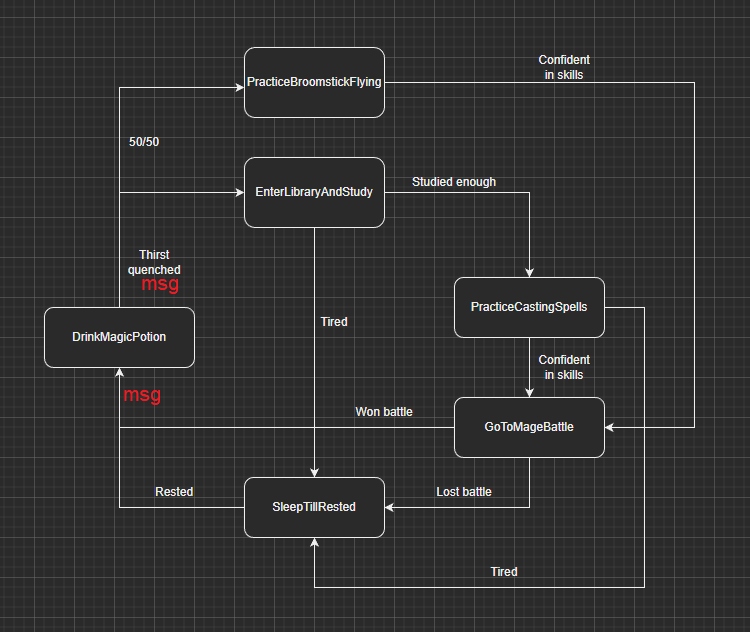

# FSM with Messaging
The Finite State Machine with Messaging project implemented in C++ (console app) was
inspired by the concepts presented in the book "Programming Game AI by Example" by Mat
Buckland. The project is aimed to create an efficient and modular system for controlling AI
behaviour using a finite state machine (FSM) architecture, enhanced with messaging
capabilities.

Our project contains a Wizard and a Witch. Their states can be found in the state diagrams
bellow

## Wizard State Diagram

## Witch State Diagram

## Program Demonstration

